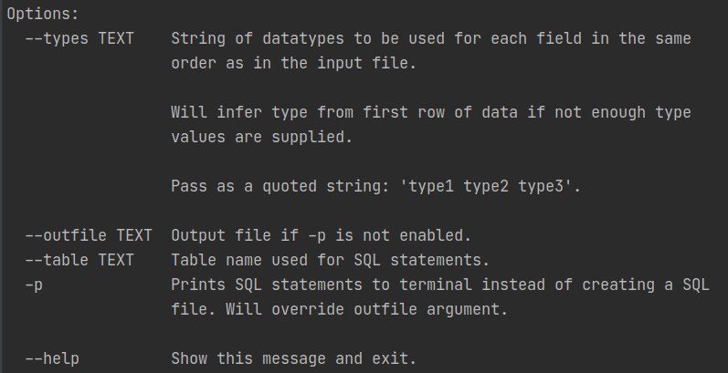

### SQL insert generator

#### Requirements:
- Poetry
- Python3

#### Usage:
    poetry run generator {f_in} {*options}


#### Input: f_in (CSV, TXT, XLSX, XLSM)
- If CSV/TXT: Delimiter = `,`; quote character = `"`
- If Excel: First ("active") sheet will be used

#### `Data type` options:
- `str` --> `varchar2(35)`
- `strX` --> `varchar2(X)`; `X::int`
- `int` --> `number(22,0)`
- `intX` --> `number(X, 0)`; `X::int`
- `float` --> `number(22,2)`

#### Output: {f_in}.sql
```
create table {table_name} (col1 col1_datatype, ...);
INSERT INTO {table_name} (col1, ...) VALUES (val1, ...);
...
```

#### Disclaimer:
Datatypes use Oracle SQL types. Written to easily load external data into a temp database table to compare against existing tables.
